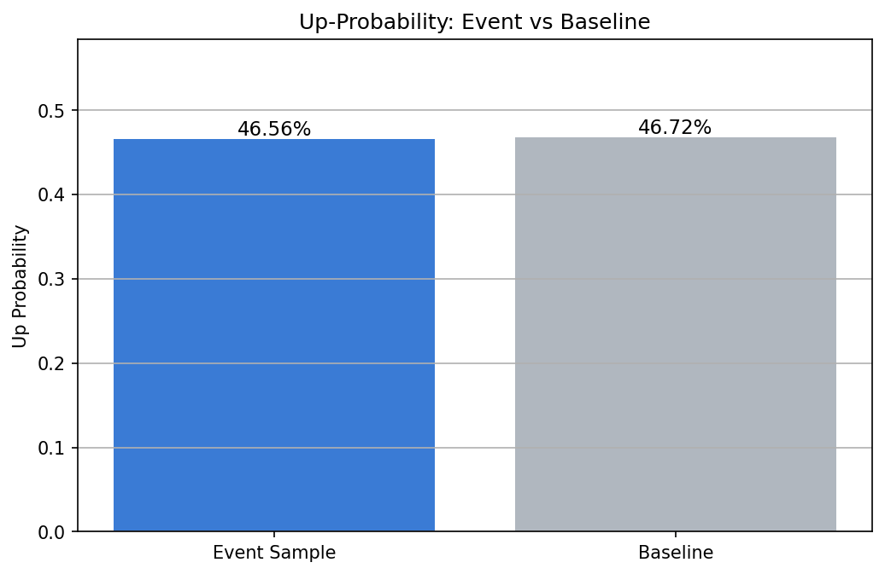
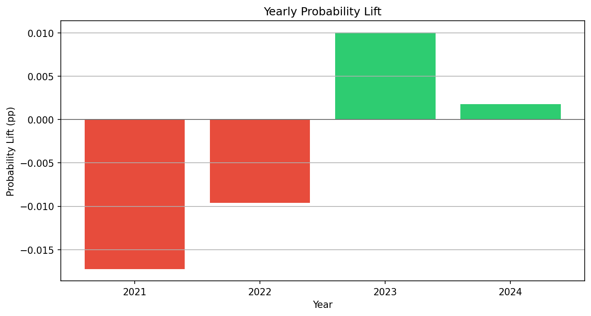
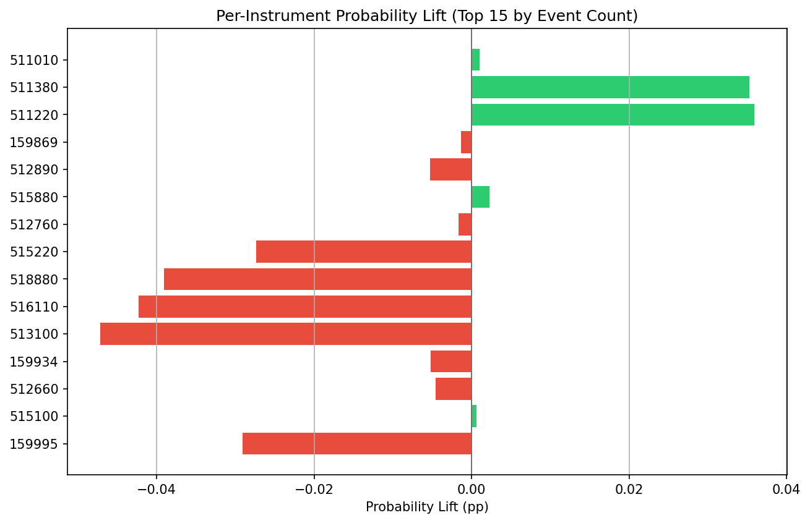

# AutoETF Research Agent 条件事件研究报告

## 1. 用户问题

研究成交额放大超过1.5倍、当日上涨但涨幅小于2%的ETF，隔日上涨概率是否更高？

## 2. 结构化研究假设

- 研究对象：ETF
- 研究目标：检验多个条件同时成立时，ETF 后续表现是否优于基准。
- 条件规则：
  - 当日成交额相对近期均值放大。：`amount_ratio_20d > 1.0`
  - 当日收盘价相对前一交易日上涨。：`return_1d > 0.0`
- 评价目标：下一交易日收益率为正。：`future_return_1d > 0.0`

## 3. 样本与事件统计

- 全样本数量：66388
- 满足条件样本数量：14367
- 条件样本占比：21.64%
- 最小样本阈值：200
- 样本是否充足：是

## 4. 次日上涨概率检验

- 条件样本次日上涨概率：46.56%
- 全样本次日上涨概率：46.72%
- 概率提升：-0.16%

## 5. 次日平均收益检验

- 条件样本次日平均收益：0.06%
- 全样本次日平均收益：-0.01%
- 平均收益提升：0.06%

## 6. 分年份稳定性

| group | event_count | event_up_probability | baseline_up_probability | probability_lift | event_mean_return | baseline_mean_return | mean_return_lift |
| --- | --- | --- | --- | --- | --- | --- | --- |
| 2021 | 1654 | 47.40% | 49.13% | -1.72% | -0.03% | 0.00% | -0.03% |
| 2022 | 3933 | 45.13% | 46.09% | -0.96% | -0.10% | -0.07% | -0.03% |
| 2023 | 4334 | 46.59% | 45.58% | 1.01% | 0.02% | -0.03% | 0.05% |
| 2024 | 4446 | 47.48% | 47.30% | 0.18% | 0.26% | 0.07% | 0.19% |

## 7. 诊断结论

本诊断基于条件事件样本数量、次日上涨概率提升、次日平均收益提升和分年份稳定性。

### 优势

- 条件样本的次日平均收益高于全样本平均水平。

### 风险

- 条件样本的次日上涨概率相对全样本提升不明显。
- 该条件分年份表现不稳定，可能依赖特定市场环境。

### 改进建议

- 建议后续将该条件作为二值信号，与趋势、相对强度、风险因子共同检验。

## 8. 是否建议继续研究

谨慎继续

## 9. 免责声明

本系统仅用于量化研究与历史回测分析，不构成任何投资建议。历史回测结果不代表未来收益。