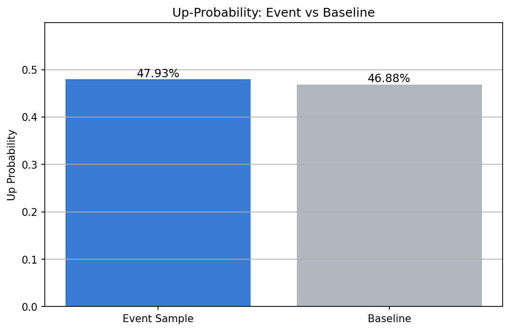
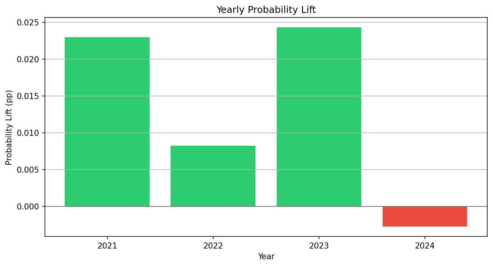
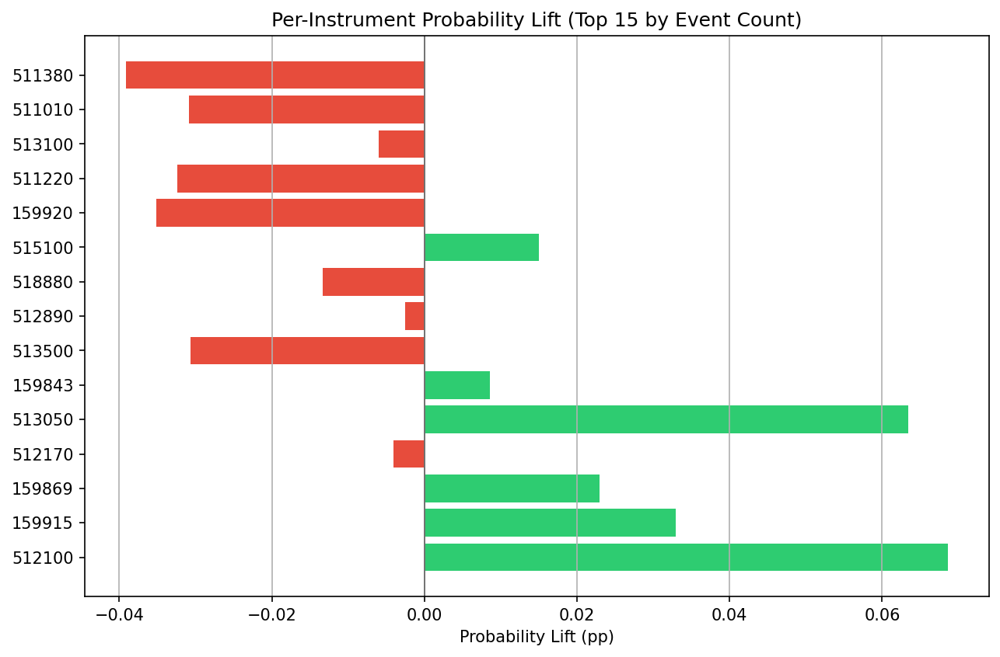

# AutoETF Research Agent 条件事件研究报告

## 1. 用户问题

研究成交额放大、20日动量强、波动率低的ETF，未来5日是否有超额收益？

## 2. 结构化研究假设

- 研究对象：ETF
- 研究目标：检验成交额放大对应条件下，ETF 后续表现是否优于基准。
- 条件规则：
  - 当日成交额相对近期均值放大。：`amount_ratio_20d > 1.0`
- 评价目标：未来5个交易日的收益率。：`future_return_5d > 0.0`

## 3. 样本与事件统计

- 全样本数量：66388
- 满足条件样本数量：26505
- 条件样本占比：39.92%
- 最小样本阈值：200
- 样本是否充足：是

## 4. 次日上涨概率检验

- 条件样本次日上涨概率：47.93%
- 全样本次日上涨概率：46.88%
- 概率提升：1.05%

## 5. 次日平均收益检验

- 条件样本次日平均收益：0.14%
- 全样本次日平均收益：-0.03%
- 平均收益提升：0.17%

## 6. 分年份稳定性

| group | event_count | event_up_probability | baseline_up_probability | probability_lift | event_mean_return | baseline_mean_return | mean_return_lift |
| --- | --- | --- | --- | --- | --- | --- | --- |
| 2021 | 3090 | 53.14% | 50.84% | 2.30% | 0.16% | -0.02% | 0.19% |
| 2022 | 7613 | 46.67% | 45.85% | 0.82% | -0.23% | -0.29% | 0.06% |
| 2023 | 7947 | 48.21% | 45.78% | 2.43% | -0.07% | -0.20% | 0.13% |
| 2024 | 7855 | 46.84% | 47.11% | -0.27% | 0.70% | 0.39% | 0.31% |

## 7. 诊断结论

本诊断基于条件事件样本数量、次日上涨概率提升、次日平均收益提升和分年份稳定性。

### 优势

- 条件样本的次日上涨概率相对全样本有小幅提升。
- 条件样本的次日平均收益高于全样本平均水平。
- 该条件在多数年份的概率提升为正，稳定性相对更好。

### 风险

### 改进建议

- 建议继续观察分年份稳定性和交易成本后的有效性。

## 8. 是否建议继续研究

谨慎继续

## 9. 免责声明

本系统仅用于量化研究与历史回测分析，不构成任何投资建议。历史回测结果不代表未来收益。